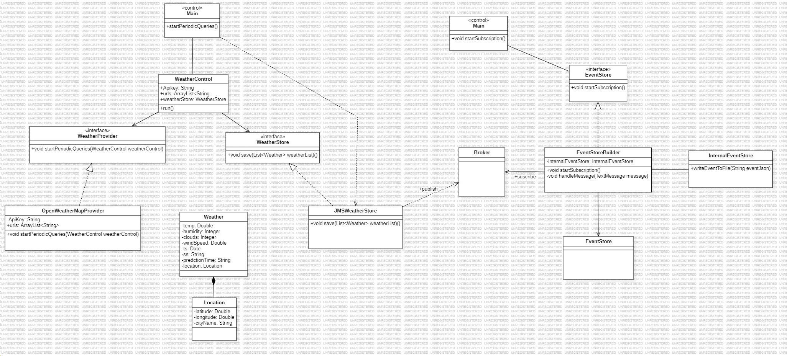

# Practice 2. Incorporating data into the system architecture. 

## Personal information

- **Name**: Samuel Déniz Santana
- **Subject**: Desarrollo de Aplicaciones para Ciencia de Datos (Development of Data Science Applications)
- **Year**: 2nd
- **Degree**: Degree in Data Science and Engineering
- **School of Computer Science of the University of Las Palmas de Gran Canaria**

## Summary of the Functionality
This project is a continuation of the previous practice and is designed to handle weather data using Java 17 and the IntelliJ environment. The application consists of three parts: Event Provider, a Broker (using Apache ActiveMQ), and Event Store Builder.

The idea is that the Event Provider module gets weather data and converts it into events in JSON format. These events include information such as the time of the forecast, the source of the data and the location in coordinates. The metrics used for temperature and velocity are compliant with the practice specifications, allowing for consistency in data presentation and analysis.

These events are sent to the Broker (ActiveMQ), which acts as an intermediary between the modules. The Event Store Builder is responsible for subscribing to the topic and storing these events in an orderly manner in a directory, organising them by source and date.
## Design

In the following, some design principles and patterns present in the code will be explained:

### SOLID Design Principles:

**Dependency Inversion Principle (DIP):**

The WeatherProvider interface and its OpenWeatherMapProvider implementation allow dependency inversion. The interface provides an abstraction that facilitates the replacement of weather data providers without changing the code that consumes them.

### Design Patterns:

**Observer Pattern:**

The use of MessageListener in EventStoreBuilder and JMSWeatherStore follows the Observer pattern. When a message is received in the broker topic, observers are notified to perform some action.

## Class Diagram

